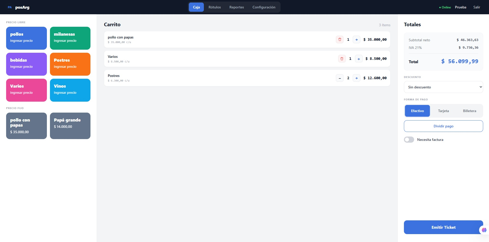
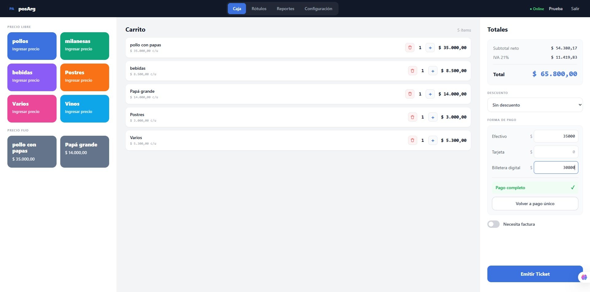
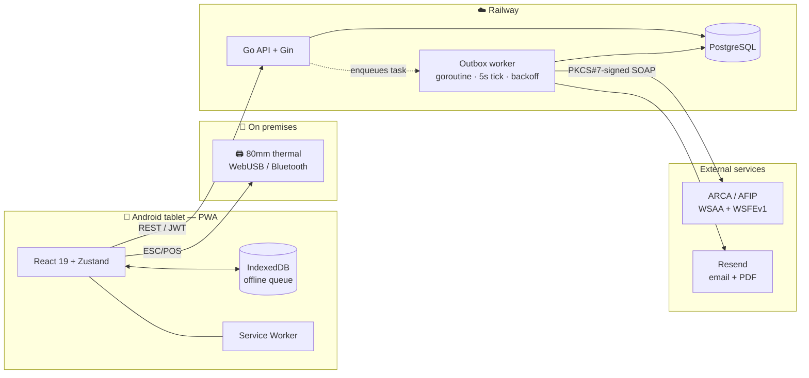

<h1 align="center">posArg</h1>

<p align="center">
  <strong>Point-of-sale system with electronic invoicing (ARCA/AFIP), written in Go.</strong><br>
  Go backend + PostgreSQL · offline-first PWA · ESC/POS thermal printing
</p>

<p align="center">
  
  
  
  
  
  
</p>

<p align="center">
  <a href="README.md">🇦🇷 Leer en Español</a>&nbsp;&nbsp;·&nbsp;&nbsp;🇺🇸 English
</p>

---

> ## 🟢 This is in production, today, handling real money
>
> A restaurant in Mendoza, Argentina **has been charging customers with this system since July
> 2026**. It replaced the local's fiscal cash register: every receipt a customer gets comes out of
> this code, with a **real CAE authorized by ARCA** (Argentina's tax authority) and a valid fiscal
> QR code.
>
> That changes the rules of the game compared to a typical portfolio project. There's no "I'll fix
> it tomorrow": if the Go backend goes down, the business can't charge customers and is exposed to
> a tax infraction. Every architecture decision below exists for that reason, and has been
> validated against the reality of a place that invoices every single day.

<p align="center">
  
</p>

---

## If you have 3 minutes, look at this

This is the flagship project in my portfolio and the only one running in production. These are the
five Go files that best show how I work:

| File | Why it's worth reading |
|---|---|
| [`internal/handlers/outbox.go`](backend/internal/handlers/outbox.go) | Background worker using the **outbox pattern**: ticker, exponential backoff, sweep mutex, throttled alerts. **A sale is never lost even if ARCA is down.** |
| [`internal/arca/auth.go`](backend/internal/arca/auth.go) | WSAA authentication against AFIP: **PKCS#7** signing of the TRA with `crypto/x509`, without writing files to disk. Token cached both in memory *and* in Postgres. |
| [`internal/models/venta.go`](backend/internal/models/venta.go) | Fiscal floating-point arithmetic with no phantom cents, with the invariant pinned down by tests. |
| [`internal/handlers/helpers.go`](backend/internal/handlers/helpers.go) | Atomic sequential numbering with `SELECT … FOR UPDATE`, isolated per company. |
| [`internal/middleware/ratelimit.go`](backend/internal/middleware/ratelimit.go) | Per-IP rate limiting with a **non-spoofable** `X-Forwarded-For`, with the reasoning behind it commented in the code. |

The whole backend is **~4,700 lines of Go** with no heavy frameworks: Gin for routing, GORM for
Postgres, and the standard library for everything else — SOAP, XML, cryptography, concurrency.

---

## The problem

A small restaurant needed to move off its fiscal cash register onto electronic invoicing. The
existing systems in that space wanted a monthly fee in USD, certified hardware, and a stable
connection the place doesn't have. The business's real constraints drove the design:

| Constraint | Design consequence |
|---|---|
| The venue's WiFi drops several times a week | A sale **can't depend on internet**: it still gets charged and the receipt regularizes itself afterward |
| ARCA/AFIP goes down often, without warning | The CAE is requested in the background with retries; the customer walks away with a receipt in hand regardless |
| Numbering must be sequential by law | Atomic numbering in the database with guaranteed order, even when syncing offline sales |
| The fiscal QR is mandatory on every receipt | The QR is generated with the **real** data ARCA returned, never with provisional local data |
| One person operates it, hands full, on a tablet | Low-tap UI, big buttons, no multi-step flows |
| Infrastructure budget ≈ zero | Everything runs on free/hobby tiers: Railway + Vercel + Postgres |

---

## The Go backend

What's interesting about this project isn't the CRUD. It's what happens when the system **has to
keep working** with AFIP down, no internet, and real money on the line.

### 1. A sale is never lost: the outbox pattern

Requesting the CAE from ARCA inside the HTTP request means an AFIP timeout = a lost sale. Instead,
the sale and its pending task are written **in the same transaction**:

```go
// handlers/ventas.go — the sale and its task are born together, or not at all
err = h.db.WithContext(ctx).Transaction(func(tx *gorm.DB) error {
    numero, err = siguienteNumero(tx, req.Tipo, empresaID, empresa.PuntoVenta)
    if err != nil {
        return fmt.Errorf("assign number: %w", err)
    }
    // ... create sale + line items ...
    return encolarTarea(tx, ventaID, empresaID, models.TareaObtenerCAE)
})
```

Only after that does it try to get the CAE online. If it succeeds, the customer leaves with the
full fiscal receipt; if not, a **non-fiscal ticket** is printed and the worker retries. It's
structurally impossible for a sale to exist without its CAE task queued.

### 2. The worker: concurrency with the standard library

The worker starts as a goroutine from `main.go`, tied to a `context` that's canceled on shutdown.
No external queues or Redis: a `time.Ticker` every 5 seconds and `sync` primitives.

```go
// The sweep never overlaps itself: if one is already running, this tick is skipped.
func (w *Worker) procesarPendientes(ctx context.Context) {
    if !w.sweepMu.TryLock() {
        return
    }
    defer w.sweepMu.Unlock()
    ...
}

// Exponential backoff: 5s, 10s, 20s… capped at 5 min. 288 attempts ≈ 24h of persistence.
func backoff(intentos int) time.Duration {
    if intentos <= 0 {
        return 0
    }
    if intentos > 20 {
        return 5 * time.Minute
    }
    if d := 5 * time.Second << uint(intentos-1); d < 5*time.Minute {
        return d
    }
    return 5 * time.Minute
}
```

Details that make the difference in production:

- **`caeMu`** serializes CAE requests: two concurrent requests for the same CUIT (tax ID) would
  break the sequential order ARCA requires.
- **12-second `context.WithTimeout`** per call to AFIP, so a hung server doesn't block the whole
  sweep.
- **Throttled email alerts (30 min)**, marking the send *before* actually sending it: if the email
  fails, the window is still respected instead of retrying every 5 seconds during an ARCA outage.
- **Idempotency**: `obtenerCAE` first checks whether the sale already has a CAE and returns the
  existing one, so a retry never duplicates a receipt in front of AFIP.
- Tasks older than 30 days clean themselves up on every sweep.

### 3. PKCS#7 signing against AFIP, entirely in memory

WSAA requires an *access request ticket* signed with the taxpayer's X.509 certificate. The
implementation builds the XML, signs it, and sends it over SOAP using `encoding/xml`,
`crypto/x509`, `encoding/pem`, and `net/http` — no third-party SDK:

```go
// signTRA signs using the PEM content directly, without reading files from
// disk — necessary for PaaS (Railway) and for multi-tenant.
func signTRA(tra []byte, certPEM, keyPEM string) (string, error) {
    certBlock, _ := pem.Decode([]byte(certPEM))
    cert, err := x509.ParseCertificate(certBlock.Bytes)
    ...
    keyBlock, _ := pem.Decode([]byte(keyPEM))
    key, err := x509.ParsePKCS1PrivateKey(keyBlock.Bytes)
    ...
    signed, err := pkcs7.NewSignedData(tra)
    if err := signed.AddSigner(cert, key, pkcs7.SignerInfoConfig{}); err != nil { ... }
    der, err := signed.Finish()
    return base64.StdEncoding.EncodeToString(der), nil
}
```

The token lives for 12 hours and AFIP penalizes repeated logins, so it's cached on **two levels**:
an in-memory `map[int64]*tokenCache` with a per-CUIT mutex, and a Postgres table with an *upsert*
(`clause.OnConflict`) so a Railway redeploy doesn't waste a fresh login.

Receipt numbers are never invented: they come from `FECompUltimoAutorizado` on every emission,
which is the only source of truth ARCA accepts.

### 4. Atomic numbering, isolated per company

Two concurrent requests can't grab the same number. The counter is read with a row lock inside the
sale's own transaction:

```go
tx.Clauses(clause.Locking{Strength: "UPDATE"}).
   Where("empresa_id = ? AND tipo = ? AND punto_venta = ?", empresaID, tipo, puntoVenta).
   First(&contador)
```

The system also distinguishes a **local number** (provisional, for charging instantly) from a
**fiscal number** (the one ARCA assigned). The printed receipt and QR always use the fiscal one:
rebuilding the QR with the local number would make ARCA reject it on validation.

### 5. Sequential order holds even with offline sales

If three sales were queued on the tablet with no internet, syncing them in any order would break
the legally required sequential order. It's locked down from three angles, with the final lock
living in Go:

```go
// The worker refuses to request a CAE for a sale if an earlier one is still unauthorized.
if bloqueada, err := w.hayAnteriorSinCAE(venta.Tipo, venta.EmpresaID, venta.CreatedAt, venta.ID); err != nil {
    return nil, fmt.Errorf("check order: %w", err)
} else if bloqueada {
    return nil, errCAEBloqueadaPorOrden
}
```

Ties are broken using `(created_at, id)` so two sales with the same timestamp still get a
deterministic total order. The sentinel error propagates via `errors.Is` and **doesn't count as a
failed attempt**: the task waits, it doesn't burn through retries.

### 6. Fiscal arithmetic with no phantom cents

The final price the cashier types in is the source of truth. Net comes from dividing, and VAT
comes from **subtraction**, not from 21% of a rounded net — so `net + VAT == final price` always,
exactly:

```go
final := req.precioFinalUnit()
neto := redondear(final / 1.21)
ivaUnit := redondear(final - neto)
return VentaItem{
    PrecioNeto: neto,
    IVA:        redondear(ivaUnit * float64(cantidad)),  // rounded PER UNIT
    Total:      redondear(final * float64(cantidad)),    // and only then × quantity
}
```

Rounding per unit before multiplying makes `3 × one unit` add up to exactly the same as three
one-unit line items. It sounds minor; it isn't when the receipt total has to match to the cent
what's declared to ARCA. There are tests pinning down exactly that property, plus backward
compatibility with older sales queued offline: a sale that's already been printed **can't change
its amount** when it syncs.

### 7. Migrations that self-heal in production

The system started single-tenant and became multi-tenant **with real data already inside it**.
Migrations are idempotent `DO $$` blocks that run on every startup: they add `empresa_id`,
backfill it, repair the counters' primary key, and drop orphaned global unique indexes that were
blocking a new client's signup. No taking the service down to migrate by hand.

### 8. Secure by default

- **JWT with `empresa_id` in the claims** — every query filters by it; tenant isolation doesn't
  depend on the frontend sending the right parameter.
- **Per-IP rate limiting** on login, register, and admin, using the *rightmost* value of
  `X-Forwarded-For` (the only one Railway's proxy stamps and the client can't forge). Covered by a
  test for the spoofing attempt itself.
- **Internal errors logged with `log/slog`, never returned to the client** — a raw Postgres error
  would leak column and constraint names.
- **CORS restricted to explicit origins**, never `*`, because the API accepts `Authorization`.
- **ARCA certificates never touch the repo or the API response**: stored per company in the
  database, marked `json:"-"` so no response can ever leak them, and signed in memory as PEM
  without writing to the container's disk.
- **Fail-fast on startup** if `JWT_SECRET` is missing: better not to boot than to boot insecurely.
- **Graceful shutdown** via `signal.Notify` + `srv.Shutdown(ctx)` and worker cancellation, so a
  deploy never cuts a sale in half.

### 9. Production details you only learn by getting burned

- **Embedded timezone**: `_ "time/tzdata"` bakes the IANA database into the binary, because the
  container doesn't ship it and `time.LoadLocation` was failing. Reports are computed in Argentina
  time — parsing in UTC made a 9:30 PM sale fall on the next day.
- **`[start, end)` ranges** instead of `DATE(created_at) = ?`, so the index can actually be used
  instead of forcing a full scan.
- **Mock mode**: with no certificates loaded, the system generates fake CAEs and lets you test the
  entire flow without touching AFIP's servers. It turns itself off as soon as the company switches
  to `arca_env = produccion`.

---

## What the system does

**Checkout** — Sell fixed-price or open-price products, quantities and combo discounts. Single or
**split** payment across cash, card, and digital wallet. Fiscal receipt (Factura B) or Factura A
with CUIT validation. Thermal printing over **WebUSB** or **Web Bluetooth**, straight from the
tablet's browser.

**Fiscal** — Receipt formatted per **RG 5614/2024** (VAT breakdown, consumer transparency) and QR
per **RG 4892/2020**. Factura A/B generated as a PDF in Go and emailed automatically. A *Pending
ARCA* screen to void or fix stuck receipts.

**Operations** — Daily cash closing with VAT breakdown, by payment method and receipt number range.
History with a calendar view and reprinting of receipts with their original CAE. Adhesive shelf
labels. Email alert when receipts fail to get a CAE.

**Platform** — Multi-tenant: each business with its own CUIT, certificates, numbering, and isolated
data. Admin panel. Installable PWA, running full-screen on the tablet.

<p align="center">
  
</p>

---

## Architecture



**Flow of a sale while ARCA is down:**

```
Checkout → sale + CAE task (1 transaction) → online attempt fails
        → NON-FISCAL ticket printed, customer leaves → worker retries every 5s…5min
        → CAE obtained → fiscal number + QR saved → PDF emailed (if it's a Factura)
```

---

## The frontend, briefly

The PWA is React 19 + TypeScript, but two parts of it are not CRUD:

- **Genuinely offline-first**: an IndexedDB queue, automatic sync when the connection comes back,
  and a Service Worker with `NetworkFirst` for the API. Offline sales are tagged with the account
  that created them, so they never sync under another user's JWT.
- **Hand-written ESC/POS**: no driver or print server, the browser talks directly to the thermal
  printer. A custom TypeScript encoder — CP1252 encoding for accented characters, `GS ! n` for font
  scaling, `GS ( k` for the fiscal QR, 512-byte chunking over USB and 20-byte chunking with a 12ms
  pause over BLE (Bluetooth Low Energy's guaranteed minimum MTU).

---

## Stack

| Layer | Technology |
|---|---|
| **Backend** | **Go 1.25**, Gin, GORM |
| **Database** | PostgreSQL 16 |
| **Fiscal** | Hand-written SOAP WSAA/WSFEv1, PKCS#7 (`go.mozilla.org/pkcs7`), `go-qrcode`, PDF via `go-pdf/fpdf` |
| **Auth** | JWT (`golang-jwt/v5`), bcrypt (`golang.org/x/crypto`), rate limiting (`golang.org/x/time/rate`) |
| **Frontend** | React 19, TypeScript 6, Vite 8, Tailwind CSS 3, Zustand, React Router 7 |
| **Offline** | vite-plugin-pwa + Workbox, IndexedDB |
| **Hardware** | WebUSB, Web Bluetooth, custom ESC/POS encoder |
| **Deploy** | Railway (API + Postgres, multi-stage Docker), Vercel (frontend) |

---

## Project structure

```
.
├── backend/                     # Go API — ~4,700 lines
│   ├── cmd/main.go              # bootstrap, worker as a goroutine, graceful shutdown
│   ├── config/                  # env vars (JWT_SECRET forces fail-fast)
│   └── internal/
│       ├── api/routes.go        # routes, strict CORS
│       ├── arca/                # WSAA (PKCS#7 signing) + WSFEv1 (CAE) + fiscal QR
│       ├── db/connect.go        # self-healing, idempotent migrations
│       ├── handlers/            # sales, invoices, sync, outbox worker, reports, admin
│       ├── middleware/          # JWT, admin, rate limiting
│       ├── models/              # domain + VAT arithmetic
│       └── pdf/                 # official-format Factura A/B
├── frontend/                    # React PWA — ~5,700 lines
│   └── src/
│       ├── pages/               # Sale, Reports, Config, Admin, Labels, Setup
│       ├── components/features/ # cart, checkout, pending ARCA, labels
│       ├── lib/                 # printer (ESC/POS), offline (IndexedDB), api, emitirVenta
│       └── stores/               # Zustand: sale, sync, printer, auth, company
└── docker-compose.yml           # full dev environment
```

---

## Running locally

**With Docker (everything together):**

```bash
cp .env.example .env      # fill in JWT_SECRET: openssl rand -hex 32
docker compose up
# frontend → http://localhost:5173   ·   API → http://localhost:8080
```

**Without Docker:**

```bash
cd backend  && go mod download && go run ./cmd/main.go
cd frontend && npm install && npm run dev
```

With no ARCA certificates loaded, the system runs in **mock mode**: it generates fake CAEs and lets
you test the entire flow (sale → CAE → print → email) without touching AFIP's servers.

**Tests:**

```bash
cd backend && go test ./...
```

They cover the fiscal core: VAT calculation invariants (`net + VAT == final price`, an N-unit line
== N one-unit lines, backward compatibility with legacy offline-queued sales), receipt totals, CUIT
parsing, rate limiting (including the `X-Forwarded-For` spoofing attempt), and the format of
operational alerts.

---

## API

All routes hang off `/api`. Protected ones require `Authorization: Bearer <jwt>`.

| Method | Route | Description |
|---|---|---|
| `POST` | `/ventas` | Issues a receipt — assigns a number, queues the CAE task, returns `pendiente_cae` |
| `GET` | `/ventas` | History (filterable by date, with line items) |
| `GET` | `/ventas/dias` | Days with sales in the month — used to paint the calendar |
| `POST` | `/facturas` | Issues a Factura A/B with customer data |
| `POST` | `/sync/ventas` | Uploads the batch of offline sales, respecting their order |
| `GET` | `/pendientes-cae` | Receipts stuck without a CAE |
| `POST` | `/pendientes-cae/:id/anular` | Permanently cancels a sale's CAE |
| `PUT` | `/pendientes-cae/:id/corregir` | Fixes customer data and re-queues it |
| `GET` | `/reportes/cierre` | Daily cash closing |
| `GET/PUT` | `/empresa` | Business's fiscal data |
| `GET/POST/PUT/DELETE` | `/productos`, `/rotulos` | CRUD |
| `POST` | `/auth/login`, `/auth/register` | Authentication (rate limit: 5/min) |
| `GET` | `/health` | Health check for Railway |
| — | `/admin/*` | Account management (`X-Admin-Secret` header, rate limit: 10/min) |

---

## Status

System in production, under active maintenance and evolution based on what the client actually
needs — the latest features (shelf labels, receipt number range in the cash closing) came from
concrete requests from the venue.

**Next steps:** credit notes (receipt type 8), receipt status lookup against ARCA, and an
accounting export for the client's accountant.

---

## About the project

Built end-to-end by **Julián Fermentini** — product, architecture, backend, frontend, fiscal
integration, deployment, and customer support.

It started as a project for the *Automata and Languages* course at Universidad del Aconcagua (UDA)
and ended up in production, actually invoicing. It complies with current Argentine tax regulations:
RG 4892/2020 (QR), RG 5614/2024 (consumer-facing fiscal transparency), and Ley 27.743.

📄 The repository does not include certificates, keys, or credentials: ARCA's `.crt`/`.key` files
are excluded via `.gitignore` and are loaded per company outside of the codebase.
