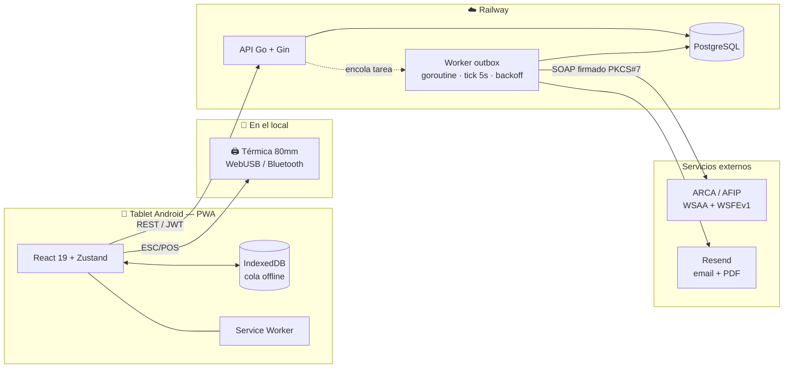

<h1 align="center">posArg</h1>

<p align="center">
  <strong>Punto de venta con facturación electrónica ARCA/AFIP, escrito en Go.</strong><br>
  Backend Go + PostgreSQL · PWA offline-first · impresión térmica ESC/POS
</p>

<p align="center">
  
  
  
  
  
  
</p>

---

> ## 🟢 Esto está en producción, hoy, con plata real
>
> Un restaurante de Mendoza, Argentina **cobra con este sistema desde julio de 2026**.
> Reemplazó a la registradora fiscal del local: cada ticket que recibe un cliente sale de este
> código, con **CAE real autorizado por ARCA** y QR fiscal válido ante la AFIP.
>
> Eso cambia las reglas del juego respecto de un proyecto de portfolio común. No hay "lo arreglo
> mañana": si el backend Go falla, el negocio no puede cobrar y queda expuesto a una infracción
> fiscal. Cada decisión de arquitectura de acá abajo existe por ese motivo, y está validada
> contra la realidad de un local que factura todos los días.

<p align="center">
  
</p>

---

## Si tenés 3 minutos, mirá esto

Es el proyecto principal de mi portfolio y el único que corre en producción. Estos son los cinco
archivos Go que mejor muestran cómo trabajo:

| Archivo | Por qué vale la pena |
|---|---|
| [`internal/handlers/outbox.go`](backend/internal/handlers/outbox.go) | Worker en background con patrón *outbox*: ticker, backoff exponencial, mutex de barrido, alertas con throttle. **Una venta nunca se pierde aunque ARCA esté caído.** |
| [`internal/arca/auth.go`](backend/internal/arca/auth.go) | Autenticación WSAA contra AFIP: firma **PKCS#7** del TRA con `crypto/x509`, sin escribir archivos al disco. Cache de token en memoria *y* en Postgres. |
| [`internal/models/venta.go`](backend/internal/models/venta.go) | Aritmética fiscal en punto flotante sin centavos fantasma, con la invariante fijada por tests. |
| [`internal/handlers/helpers.go`](backend/internal/handlers/helpers.go) | Numeración correlativa atómica con `SELECT … FOR UPDATE`, aislada por empresa. |
| [`internal/middleware/ratelimit.go`](backend/internal/middleware/ratelimit.go) | Rate limit por IP con `X-Forwarded-For` **no spoofeable**, y el razonamiento de por qué, comentado. |

Todo el backend son **~4.700 líneas de Go** sin frameworks pesados: Gin para el router, GORM para
Postgres y la biblioteca estándar para todo lo demás — SOAP, XML, criptografía, concurrencia.

---

## El problema

Un restaurante chico necesitaba dejar la registradora fiscal y pasar a factura electrónica. Los
sistemas del rubro le pedían abono mensual en dólares, hardware homologado y una conexión estable
que el local no tiene. Las restricciones reales del negocio son las que definieron el diseño:

| Restricción | Consecuencia de diseño |
|---|---|
| El WiFi del local se corta varias veces por semana | La venta **no puede depender de internet**: se cobra igual y el comprobante se regulariza solo |
| ARCA/AFIP se cae seguido, y sin aviso | El CAE se pide en background con reintentos; el cliente se va con un ticket en la mano igual |
| La numeración debe ser correlativa por ley | Numeración atómica en base de datos y orden garantizado incluso al sincronizar ventas offline |
| El QR fiscal es obligatorio en todo comprobante | QR generado con los datos **reales** que devolvió ARCA, nunca con los provisorios locales |
| Opera una sola persona, con las manos ocupadas, sobre una tablet | UI de pocos toques, botones grandes, sin flujos de varios pasos |
| Presupuesto de infraestructura ≈ cero | Todo corre en planes free/hobby: Railway + Vercel + Postgres |

---

## El backend en Go

Lo interesante de este proyecto no es el CRUD. Es lo que pasa cuando el sistema **tiene que seguir
funcionando** con AFIP caído, sin internet y con dinero real de por medio.

### 1. Una venta jamás se pierde: patrón *outbox*

Pedirle el CAE a ARCA dentro del request HTTP significa que un timeout de AFIP = venta perdida. En
cambio, la venta y su tarea pendiente se escriben **en la misma transacción**:

```go
// handlers/ventas.go — la venta y su tarea nacen juntas o no nacen
err = h.db.WithContext(ctx).Transaction(func(tx *gorm.DB) error {
    numero, err = siguienteNumero(tx, req.Tipo, empresaID, empresa.PuntoVenta)
    if err != nil {
        return fmt.Errorf("asignar número: %w", err)
    }
    // ... crear venta + ítems ...
    return encolarTarea(tx, ventaID, empresaID, models.TareaObtenerCAE)
})
```

Recién después se intenta el CAE en línea. Si sale, el cliente se lleva el ticket fiscal completo;
si no, se imprime un **ticket no fiscal** y el worker reintenta. Es estructuralmente imposible que
exista una venta sin su tarea de CAE encolada.

### 2. El worker: concurrencia con la biblioteca estándar

El worker arranca como goroutine desde `main.go`, atado a un `context` que se cancela en el
shutdown. Nada de colas externas ni Redis: un `time.Ticker` cada 5 segundos y las primitivas de
`sync`.

```go
// El barrido no se pisa consigo mismo: si ya hay uno corriendo, este tick pasa de largo.
func (w *Worker) procesarPendientes(ctx context.Context) {
    if !w.sweepMu.TryLock() {
        return
    }
    defer w.sweepMu.Unlock()
    ...
}

// Backoff exponencial: 5s, 10s, 20s… con techo de 5 min. 288 intentos ≈ 24 h de insistencia.
func backoff(intentos int) time.Duration {
    if intentos <= 0 {
        return 0
    }
    if intentos > 20 {
        return 5 * time.Minute
    }
    if d := 5 * time.Second << uint(intentos-1); d < 5*time.Minute {
        return d
    }
    return 5 * time.Minute
}
```

Detalles que hacen la diferencia en producción:

- **`caeMu`** serializa la obtención de CAE: dos pedidos concurrentes al mismo CUIT romperían la
  correlatividad que exige ARCA.
- **`context.WithTimeout` de 12s** por llamada a AFIP, para que un servidor colgado no bloquee el
  barrido entero.
- **Alertas por email con throttle de 30 min**, marcando el envío *antes* de mandarlo: si el mail
  falla, se respeta igual la ventana en vez de reintentar cada 5 segundos durante un apagón de ARCA.
- **Idempotencia**: `obtenerCAE` chequea primero si la venta ya tiene CAE y devuelve el existente,
  así un reintento nunca duplica un comprobante ante AFIP.
- Las tareas hechas de más de 30 días se limpian solas en cada barrido.

### 3. Firma PKCS#7 contra AFIP, todo en memoria

WSAA exige un *ticket de requerimiento de acceso* firmado con el certificado X.509 del
contribuyente. La implementación arma el XML, lo firma y lo manda por SOAP usando `encoding/xml`,
`crypto/x509`, `encoding/pem` y `net/http` — sin SDK de terceros:

```go
// signTRA firma usando el contenido PEM directamente, sin leer archivos del
// sistema — necesario para PaaS (Railway) y para multi-tenant.
func signTRA(tra []byte, certPEM, keyPEM string) (string, error) {
    certBlock, _ := pem.Decode([]byte(certPEM))
    cert, err := x509.ParseCertificate(certBlock.Bytes)
    ...
    keyBlock, _ := pem.Decode([]byte(keyPEM))
    key, err := x509.ParsePKCS1PrivateKey(keyBlock.Bytes)
    ...
    signed, err := pkcs7.NewSignedData(tra)
    if err := signed.AddSigner(cert, key, pkcs7.SignerInfoConfig{}); err != nil { ... }
    der, err := signed.Finish()
    return base64.StdEncoding.EncodeToString(der), nil
}
```

El token vive 12 horas y AFIP penaliza los logins repetidos, así que se cachea en **dos niveles**:
un `map[int64]*tokenCache` en memoria con mutex por CUIT, y una tabla en Postgres con *upsert*
(`clause.OnConflict`) para que un redeploy de Railway no gaste un login nuevo.

Los números de comprobante nunca se inventan: salen de `FECompUltimoAutorizado` en cada emisión,
que es la única fuente de verdad que ARCA acepta.

### 4. Numeración atómica, aislada por empresa

Dos requests concurrentes no pueden tomar el mismo número. El contador se lee con bloqueo de fila
dentro de la transacción de la venta:

```go
tx.Clauses(clause.Locking{Strength: "UPDATE"}).
   Where("empresa_id = ? AND tipo = ? AND punto_venta = ?", empresaID, tipo, puntoVenta).
   First(&contador)
```

Además se distingue **número local** (provisorio, para cobrar al instante) de **número fiscal** (el
que asignó ARCA). El ticket impreso y el QR usan siempre el fiscal: reconstruir el QR con el número
local haría que ARCA lo rechazara al validarlo.

### 5. El orden correlativo se respeta incluso con ventas offline

Si tres ventas quedaron guardadas en la tablet sin internet, sincronizarlas en cualquier orden rompe
la correlatividad que exige la ley. Se cierra por tres lados, y el candado final está en Go:

```go
// El worker se niega a pedir el CAE de una venta si hay otra anterior sin autorizar.
if bloqueada, err := w.hayAnteriorSinCAE(venta.Tipo, venta.EmpresaID, venta.CreatedAt, venta.ID); err != nil {
    return nil, fmt.Errorf("chequear orden: %w", err)
} else if bloqueada {
    return nil, errCAEBloqueadaPorOrden
}
```

El desempate usa `(created_at, id)` para que dos ventas con el mismo timestamp igual tengan un orden
total determinístico. El error centinela se propaga con `errors.Is` y **no cuenta como intento
fallido**: la tarea espera, no se quema los reintentos.

### 6. Aritmética fiscal sin centavos fantasma

El precio final que tipea el cajero es la fuente de verdad. El neto sale de dividir y el IVA **por
resta**, no como 21% del neto redondeado — así `neto + IVA == precio final` siempre y exacto:

```go
final := req.precioFinalUnit()
neto := redondear(final / 1.21)
ivaUnit := redondear(final - neto)
return VentaItem{
    PrecioNeto: neto,
    IVA:        redondear(ivaUnit * float64(cantidad)),  // redondeo POR UNIDAD
    Total:      redondear(final * float64(cantidad)),    // y recién después × cantidad
}
```

Redondear por unidad antes de multiplicar hace que `3 × unidad` sume exactamente lo mismo que tres
líneas de una unidad. Suena menor; no lo es cuando el total del ticket tiene que coincidir al
centavo con lo declarado a ARCA. Hay tests que fijan justamente esa propiedad, y compatibilidad
hacia atrás con las ventas viejas encoladas offline: una venta ya impresa **no puede cambiar de
importe** al sincronizarse.

### 7. Migraciones que se auto-reparan en producción

El sistema arrancó mono-empresa y se convirtió en multi-tenant **con datos reales adentro**. Las
migraciones son bloques `DO $$` idempotentes que corren en cada arranque: agregan `empresa_id`,
backfillean, reparan la PK de los contadores y borran índices únicos globales huérfanos que
bloqueaban el alta de un cliente nuevo. Nada de bajar el servicio para migrar a mano.

### 8. Seguridad por defecto

- **JWT con `empresa_id` en los claims** — todo query filtra por él; el aislamiento entre negocios
  no depende de que el frontend mande el parámetro correcto.
- **Rate limit por IP** en login, registro y admin, tomando el valor *más a la derecha* de
  `X-Forwarded-For` (el único que estampa el proxy de Railway y el cliente no puede falsificar). El
  test cubre el intento de spoofeo.
- **Errores internos logueados con `log/slog`, nunca devueltos al cliente** — un error de Postgres
  filtraría nombres de columnas y constraints.
- **CORS restringido a orígenes explícitos**, nunca `*`, porque la API acepta `Authorization`.
- **Los certificados ARCA jamás tocan el repo ni la API**: se guardan por empresa en la base,
  están marcados `json:"-"` para que ninguna respuesta pueda filtrarlos, y se firman en memoria
  como PEM sin escribir al disco del contenedor.
- **Fail-fast al arrancar** si falta `JWT_SECRET`: preferible no levantar que levantar inseguro.
- **Graceful shutdown** con `signal.Notify` + `srv.Shutdown(ctx)` y cancelación del worker, para no
  cortar una venta a la mitad durante un deploy.

### 9. Detalles de producción que se aprenden rompiéndose

- **Zona horaria embebida**: `_ "time/tzdata"` mete la base IANA en el binario, porque el contenedor
  no la trae y `time.LoadLocation` fallaba. Los reportes se calculan en hora de Argentina — parsear
  en UTC hacía que una venta de las 21:30 cayera en el día siguiente.
- **Rangos `[inicio, fin)`** en vez de `DATE(created_at) = ?`, para que el índice se pueda usar en
  lugar de forzar un scan completo.
- **Modo mock**: sin certificados cargados, el sistema genera CAE falsos y permite probar el flujo
  entero sin tocar AFIP. Se desactiva solo en cuanto la empresa pasa a `arca_env = produccion`.

---

## Qué hace el sistema

**Caja** — Venta con productos de precio fijo o precio libre, cantidades y descuento por combo. Pago
único o **dividido** entre efectivo, tarjeta y billetera digital. Ticket fiscal (Factura B) o
factura A validando CUIT. Impresión térmica por **WebUSB** o **Web Bluetooth**, directo desde el
navegador de la tablet.

**Fiscal** — Ticket con formato **RG 5614/2024** (IVA contenido, transparencia fiscal) y QR
**RG 4892/2020**. Factura A/B en PDF generada en Go y enviada por email automáticamente. Pantalla de
*Pendientes ARCA* para anular o corregir comprobantes trabados.

**Operación** — Cierre de caja por día con desglose de IVA, por método de pago y rango de
comprobantes emitidos. Historial con calendario y reimpresión de tickets con su CAE original.
Rótulos adhesivos para vitrina. Alerta por email si hay comprobantes que no consiguen CAE.

**Plataforma** — Multi-tenant: cada negocio con su CUIT, sus certificados, su numeración y sus datos
aislados. Panel de administración. PWA instalable, a pantalla completa en la tablet.

<p align="center">
  
</p>

---

## Arquitectura



**Flujo de una venta con ARCA caído:**

```
Cobro → venta + tarea CAE (1 transacción) → intento online falla
      → ticket NO FISCAL impreso, el cliente se va → worker reintenta cada 5s…5min
      → CAE obtenido → número fiscal + QR guardados → PDF por email (si es factura)
```

---

## El frontend, en corto

La PWA es React 19 + TypeScript, pero tiene dos partes que no son CRUD:

- **Offline-first de verdad**: cola en IndexedDB, sincronización automática al recuperar señal y
  Service Worker con `NetworkFirst` para la API. Las ventas offline se etiquetan con la cuenta que
  las cargó, para que no se sincronicen con el JWT de otro usuario.
- **ESC/POS escrito a mano**: no hay driver ni servidor de impresión, el navegador le habla directo
  a la térmica. Encoder propio en TypeScript — codificación CP1252 para los acentos, `GS ! n` para
  escalas de fuente, `GS ( k` para el QR fiscal, chunking de 512 bytes por USB y de 20 bytes con
  pausa de 12 ms por BLE (el MTU mínimo garantizado de Bluetooth Low Energy).

---

## Stack

| Capa | Tecnología |
|---|---|
| **Backend** | **Go 1.25**, Gin, GORM |
| **Base de datos** | PostgreSQL 16 |
| **Fiscal** | SOAP WSAA/WSFEv1 escrito a mano, PKCS#7 (`go.mozilla.org/pkcs7`), `go-qrcode`, PDF con `go-pdf/fpdf` |
| **Auth** | JWT (`golang-jwt/v5`), bcrypt (`golang.org/x/crypto`), rate limiting (`golang.org/x/time/rate`) |
| **Frontend** | React 19, TypeScript 6, Vite 8, Tailwind CSS 3, Zustand, React Router 7 |
| **Offline** | vite-plugin-pwa + Workbox, IndexedDB |
| **Hardware** | WebUSB, Web Bluetooth, encoder ESC/POS propio |
| **Deploy** | Railway (API + Postgres, Docker multi-stage), Vercel (frontend) |

---

## Estructura

```
.
├── backend/                     # API Go — ~4.700 líneas
│   ├── cmd/main.go              # arranque, worker como goroutine, graceful shutdown
│   ├── config/                  # env vars (JWT_SECRET obliga fail-fast)
│   └── internal/
│       ├── api/routes.go        # rutas, CORS estricto
│       ├── arca/                # WSAA (firma PKCS#7) + WSFEv1 (CAE) + QR fiscal
│       ├── db/connect.go        # migraciones idempotentes self-healing
│       ├── handlers/            # ventas, facturas, sync, outbox worker, reportes, admin
│       ├── middleware/          # JWT, admin, rate limit
│       ├── models/              # dominio + aritmética de IVA
│       └── pdf/                 # factura A/B en formato oficial
├── frontend/                    # PWA React — ~5.700 líneas
│   └── src/
│       ├── pages/               # Venta, Reportes, Config, Admin, Rótulos, Setup
│       ├── components/features/ # carrito, cobro, pendientes ARCA, rótulos
│       ├── lib/                 # printer (ESC/POS), offline (IndexedDB), api, emitirVenta
│       └── stores/              # Zustand: venta, sync, printer, auth, empresa
└── docker-compose.yml           # entorno completo de desarrollo
```

---

## Correr en local

**Con Docker (todo junto):**

```bash
cp .env.example .env      # completar JWT_SECRET: openssl rand -hex 32
docker compose up
# frontend → http://localhost:5173   ·   API → http://localhost:8080
```

**Sin Docker:**

```bash
cd backend  && go mod download && go run ./cmd/main.go
cd frontend && npm install && npm run dev
```

Sin certificados ARCA cargados, el sistema corre en **modo mock**: genera CAE falsos y permite
probar el flujo completo (venta → CAE → impresión → email) sin tocar los servidores de AFIP.

**Tests:**

```bash
cd backend && go test ./...
```

Cubren el núcleo fiscal: cálculo de IVA con sus invariantes de redondeo (`neto + IVA == precio
final`, línea de N unidades == N líneas de una, compatibilidad con las ventas legacy), totales de
comprobante, parseo de CUIT, rate limiting (incluido el intento de spoofear `X-Forwarded-For`) y el
formato de las alertas de operación.

---

## API

Todas las rutas cuelgan de `/api`. Las protegidas requieren `Authorization: Bearer <jwt>`.

| Método | Ruta | Descripción |
|---|---|---|
| `POST` | `/ventas` | Emite un ticket — asigna número, encola CAE, devuelve `pendiente_cae` |
| `GET` | `/ventas` | Historial (filtrable por fecha, con ítems) |
| `GET` | `/ventas/dias` | Días con ventas del mes — pinta el calendario |
| `POST` | `/facturas` | Emite factura A/B con datos del cliente |
| `POST` | `/sync/ventas` | Sube el lote de ventas offline, respetando el orden |
| `GET` | `/pendientes-cae` | Comprobantes trabados sin CAE |
| `POST` | `/pendientes-cae/:id/anular` | Cancela definitivamente el CAE de una venta |
| `PUT` | `/pendientes-cae/:id/corregir` | Corrige datos del cliente y reencola |
| `GET` | `/reportes/cierre` | Cierre de caja del día |
| `GET/PUT` | `/empresa` | Datos fiscales del negocio |
| `GET/POST/PUT/DELETE` | `/productos`, `/rotulos` | ABM |
| `POST` | `/auth/login`, `/auth/register` | Autenticación (rate limit: 5/min) |
| `GET` | `/health` | Healthcheck para Railway |
| — | `/admin/*` | Gestión de cuentas (header `X-Admin-Secret`, rate limit: 10/min) |

---

## Estado

Sistema en producción, en mantenimiento y evolución activa según lo que va necesitando el cliente
— las últimas funciones (rótulos de vitrina, rango de comprobantes en el cierre de caja) salieron de
pedidos concretos del local.

**Próximos pasos:** notas de crédito (comprobante tipo 8), consulta de estado de comprobante contra
ARCA, y export contable para el estudio del cliente.

---

## Sobre el proyecto

Desarrollado íntegramente por **Julián Fermentini** — producto, arquitectura, backend, frontend,
integración fiscal, deploy y soporte al cliente.

Nació como proyecto de la materia *Autómatas y Lenguajes* de la Universidad del Aconcagua (UDA) y
terminó en producción facturando de verdad. Cumple con la normativa fiscal argentina vigente:
RG 4892/2020 (QR), RG 5614/2024 (transparencia fiscal al consumidor) y Ley 27.743.

📄 El repositorio no incluye certificados, claves ni credenciales: los `.crt`/`.key` de ARCA están
excluidos por `.gitignore` y se cargan por empresa fuera del código.
